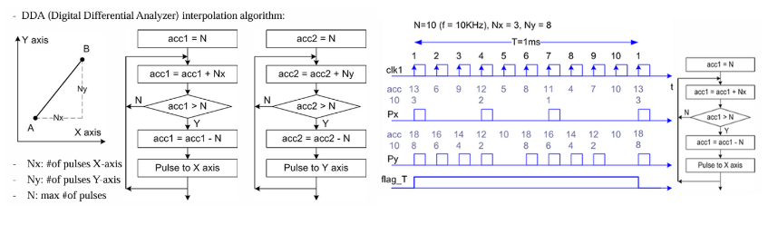
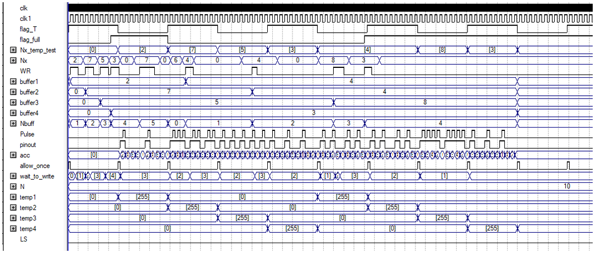
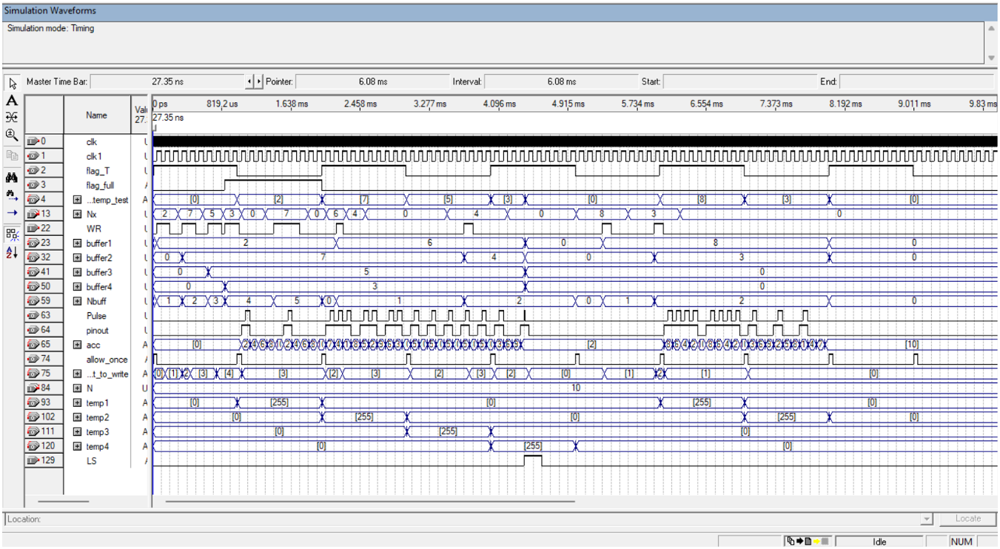

# [Verilog HDL] Pulse generator for servo in CNC applications using DDA (Digital Differential Analyzer) interpolation algorithm

This is a mini project in embedded control system course. This is an implementation for 1 axis with DDA algorithm. The same technique could be applied to following axis. 

#### Example of DDA (Digital Differential Analyzer)

   
  <i>Demonstration of DDA</i>

#### Requirement for my Pulse generator
- Nx will be loaded a new value on rising edge of WR signal. But this Nx value is not activated in the current cycle T, it is only activated at the next cycle T. 
- When the Nx value is not loaded (no WR and Nbuff = 0) in the current cycle T, Pulse is forced to 0 in the next cycle T (do not take the old value of Nx to   continue generating pulses)
- Simulation with fixed N = 10 (n is fixed)
- Clk = 1us,  clk1 = 100us, DDA algorithm is based on clk1, other signals are based on clk.
- Allow writing up to 4 WR pulses to the buffer in one flag_T cycle (Nbuff = 4), not saving Nx value to the buffer if the 5th WR pulse occurs.
-  flag_full = 1 once completely writing all 4 WR pulses. Check only when flag_full = 0 (when Nbuff = 3, 2, 1, 0) then receive new Nx value again.  

- When LS = 1,  Pulse = 0, and all buffeqrs will be deleted (consider as reset state from the beginning). Pulse is generated only at the next cycle T when LS = 0 and there is a WR signal after that.

### Test cases and explaination
#### Example of DDA (Digital Differential Analyzer)
Case 1: No LS pulse

   
  <i>Case 1</i>

- When Nx has value (2, 7, 5, 3) and flag_full is 0, the value is loaded into buffer1 – buffer 4 whenever there is posedge of WR signal.

-  When Nbuff is 4, flag_full is pull up and we do not accept any more Nx value (value 7 is not accepted by the buffer) until flag_full is down and another posedge of WR signal.(value 6 is accepted after flag_full is down). 

- The Pulse outputs every T cycle and aligns with the sequence of values loaded into the buffers. (2 , 7, 5, 3, 6, 4, 4, 8, 3). 

- When the Nx value is not loaded (no WR and Nbuff = 0) in the current cycle T, Pulse is forced to 0.

Case 2: With LS pulse

   
  <i>Case 2</i>

- When Nx has value ( 2,7,5,3 ) and flag_full is 0, the value is loaded into buffer1 – buffer 4 whenever there is posedge of WR signal. 
  
- When Nbuff is 4, flag_full is pull up and we do not accept any more Nx value (value 7 is not accepted by the buffer) until flag_full is down and another posedge of WR signal.( value 6 is accepted after flag_full is down). 

- The Pulse outputs every T cycle and aligns with the sequence of values loaded into the buffers. (2 , 7, 5, 3, 8, 3). 
  
- When LS = 1, Pulse is force to be 0 and all buffer clear to immediately, Pulse is generated only at the next cycle T when LS = 0 and there is a WR signal after that 

- When the Nx value is not loaded (no WR and Nbuff = 0) in the current cycle T, Pulse is forced to 0.
